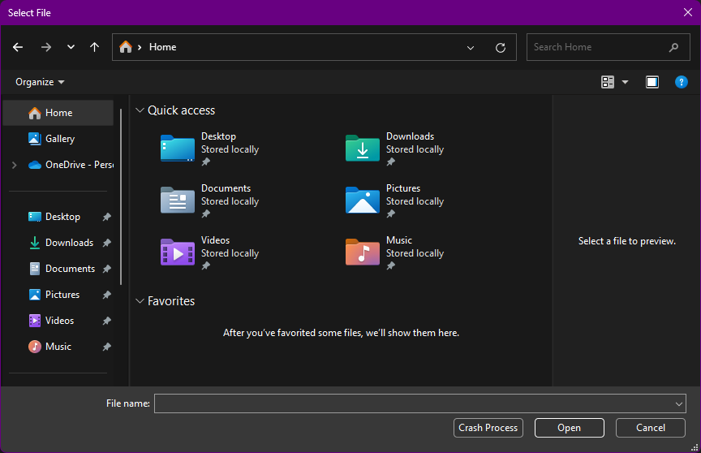

# safedlgs

> This is a proof of concept. Use this code as [you wish](LICENSE.txt).

There is no safe way to use the standard file dialog to open/save
files on Windows. What does this mean? It looks like there are several
`comctl32.dll` implementations, and some third-party Windows IME
(Input Method Editors) that can crash your application just by using
the standard file dialog from Windows.

As the file dialog contains a `EDIT` control, it opens a full range of
possible bugs/crashes when a third-party IME is configured. Which
means that just opening the file selector is a potential source of
crashes for your application.

One possible way to fix this is using a background process just to
open the file dialog. If the process crashes, we can reopen it, even
using the last location where the crash was produced.

## Demo

This project includes the following programs:

* `dlgs.exe`: Shows the native Windows file dialog using the
  [IFileDialog](https://learn.microsoft.com/en-us/windows/win32/shell/common-file-dialog)
  interface. This process can crash. Each time the user changes to
  other folder, it prints that folder to STDOUT, so we can re-open the
  file dialog in the last location.
* `test.exe`: Wrapper that (re-)executes `dlgs.exe`. This process
  shouldn't crash, if it detects that `dlgs.exe` crashed, it just
  re-open it in the last visited location.

The `dlgs.exe` will show the native file dialog with an extra "Crash
Process" button just to test how it works in case of crash:

## Crashes

You can find some stack traces in the [CRASHES](CRASHES.md) file
about real world Windows and IME bugs out there.

## License

This project is released under the terms of the MIT license. Read
[LICENSE](LICENSE.txt) for more information.
